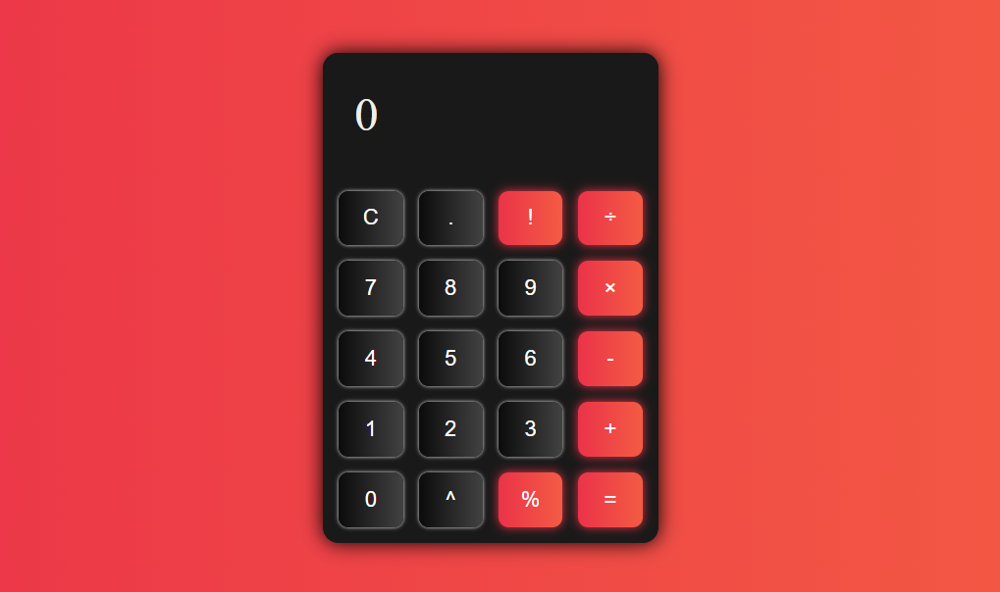

# Calculator
Simple calculator using HTML, CSS and Javascript for The Odin Project

# Learnings
* Taking keyboard input
* Using Number.isFinite(val)
* Easiest way to convert a string into number [not using Number()] is to use "+" sign before it
    Though it affects the code readability :') a cool trick to know
* Styling scroll bar

# Preview

# Demo
👉 [Live Demo](https://ruchita1010.github.io/calculator/)